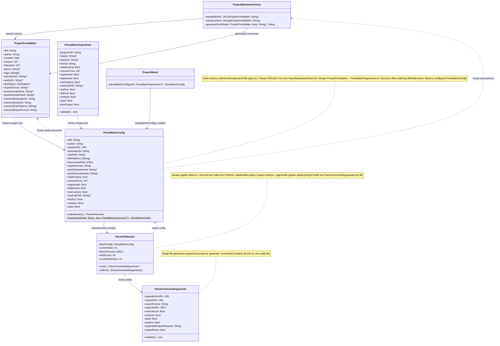

<p align="center">
  
</p>

# SwiftProyecto

<p align="center">
    
    
    
    
</p>

**SwiftProyecto** is a Swift package providing **extensible, agentic discovery** of content projects and their components. It enables AI coding agents to understand project structure, intent, and composition in a single pass through structured metadata stored in PROJECT.md front matter.

## Purpose

This project exists to provide **extensible, agentic discovery of projects and project pieces**.

**Problem**: AI coding agents need multiple utilities and multiple passes to correctly understand and render content projects. Without structured metadata, agents must infer project intent, discover components separately, and piece together rendering requirements through trial and error.

**Solution**: SwiftProyecto stores settings, utilities, project intent, and composition information in PROJECT.md front matter. This allows AI agents to:
- Understand project structure in one pass (not multiple discovery iterations)
- Access rendering settings, cast lists, and generation config immediately
- Know what utilities to invoke (hooks, TTS providers, export formats)
- Comprehend project intent (genre, description, tags) without inference

By providing **structured, machine-readable metadata**, SwiftProyecto reduces cognitive load for AI agents working with content projects.

## Overview

SwiftProyecto provides AI agents and applications with comprehensive project understanding through:

- **Agentic Discovery**: Structured metadata that AI agents can consume in one pass
- **PROJECT.md Front Matter**: Machine-readable project intent, composition, and settings
  - Project metadata (title, author, genre, tags, description)
  - Generation config (episodes directory, audio output, file patterns, export format)
  - Cast lists (character-to-voice mappings for TTS)
  - Hooks (pre/post-generation scripts for workflow automation)
  - App-specific settings (extensible via AppFrontMatterSettings protocol - **NEW in v2.6.0**)
  - All accessible via YAML front matter using UNIVERSAL library
- **File Discovery**: Recursively discover project components in folders or git repositories
- **Secure File Access**: Security-scoped bookmarks for sandboxed macOS/iOS apps
- **Hierarchical Structure**: FileNode trees for project navigation
- **SwiftData Models**: Persistent project metadata and file references
- **proyecto CLI**: LLM-powered PROJECT.md generation from directory analysis

**What SwiftProyecto Does:**
- ✅ Provides structured metadata for AI agents to understand projects
- ✅ Discovers files and builds navigable project structure
- ✅ Stores rendering settings, utilities, and intent in front matter
- ✅ Enables single-pass project comprehension (not multi-pass inference)

**What SwiftProyecto Does NOT Do:**
- ❌ Parse content files (no SwiftCompartido dependency)
- ❌ Render or generate content (provides metadata to renderers)
- ❌ Load content into memory automatically
- ❌ Manage content rendering state or caching

**Integration Pattern:**
AI agents and apps consume PROJECT.md metadata to understand project structure and intent, then use `getSecureURL(for:in:)` to access content files for parsing/rendering. See "Integration with Document Parsers" section for details.

## Architecture

SwiftProyecto provides file discovery and secure access. Apps integrate it with their own document parsers:

```
┌───────────────────────────────────────────────────────────┐
│ Produciesta (iOS/macOS App)                               │
│ - UI Views (ProjectBrowserView, DocumentLoader)           │
│ - DocumentRegistry (integration layer)                    │
│ - Calls getSecureURL() → Parses with SwiftCompartido      │
└──────┬────────────────────────────────┬───────────────────┘
       │                                │
       ▼                                ▼
┌──────────────────┐          ┌─────────────────┐
│ SwiftProyecto    │          │ SwiftCompartido │
│ (THIS)           │          │                 │
│                  │          │ - GuionDocument │
│ - File Discovery │          │ - Parsing       │
│ - ProjectModel   │          │ - AST           │
│ - FileNode       │          └─────────────────┘
│ - BookmarkMgr    │
│ - getSecureURL() │          (No direct dependency)
│   ↑              │
│   Provides URLs  │
└──────────────────┘

Flow:
1. SwiftProyecto discovers files → ProjectFileReference
2. App calls getSecureURL(for: fileRef, in: project)
3. App parses URL with SwiftCompartido
4. App stores result in DocumentRegistry
```

### FileSource Abstraction

SwiftProyecto uses a pluggable FileSource abstraction for discovering files:

```
┌─────────────────────────────────────────┐
│ ProjectService                          │
│ - discoverFiles(for: project)           │
│   ↓ delegates to                        │
│ - project.fileSource()                  │
└──────────────┬──────────────────────────┘
               │
               ▼
┌──────────────────────────────────────────┐
│ FileSource Protocol                      │
│ - discoverFiles() -> [DiscoveredFile]    │
└──────────┬───────────────┬───────────────┘
           │               │
           ▼               ▼
┌──────────────────┐  ┌─────────────────────┐
│ DirectoryFile    │  │ GitRepositoryFile   │
│ Source           │  │ Source              │
│                  │  │                     │
│ - Enumerates     │  │ - Validates .git/   │
│   local files    │  │ - Same discovery    │
│ - Excludes       │  │   as Directory      │
│   system files   │  │                     │
│ - Returns        │  │                     │
│   DiscoveredFile │  │                     │
└──────────────────┘  └─────────────────────┘
```

**Benefits**:
- Clean separation between business logic (ProjectService) and file enumeration (FileSource)
- Easy to add new source types (iCloud, remote servers, archives, etc.)
- Testable with mock FileSource implementations
- ~100 lines of code deduplication

## Features

### ✨ v2.6.0: App-Specific Settings Extension System (February 2026)

- **AppFrontMatterSettings Protocol**: Type-safe extension mechanism for app-specific PROJECT.md settings
- **Namespaced Settings**: Apps define their own settings sections without modifying SwiftProyecto
- **Complete Documentation**: See [Docs/EXTENDING_PROJECT_MD.md](Docs/EXTENDING_PROJECT_MD.md) for full guide
- **Backward Compatible**: Existing PROJECT.md files work without app-specific sections
- **Multi-App Support**: Multiple apps can store settings in the same PROJECT.md file

### ✅ v2.0: File Discovery Focus

- **FileSource Abstraction**: Pluggable file discovery via `DirectoryFileSource` and `GitRepositoryFileSource`
- **File Discovery**: Recursively discover all files in project directories or git repos
- **PROJECT.md Parser**: Lazy-loaded YAML front matter parser using UNIVERSAL library
  - Parse from file URL or string content
  - Generate PROJECT.md with type-safe `ProjectFrontMatter` struct
  - Stateless utility for easy testing and integration
  - Spec-compliant YAML parsing (handles complex arrays, quoted strings, ISO8601 dates)
- **Security-Scoped Bookmarks**: Per-project AND per-file bookmark support for sandboxed apps
- **FileNode Tree**: Hierarchical file tree with sorted children (directories first)
- **SwiftData Models**: `ProjectModel` and `ProjectFileReference` with cascade delete
- **Git Repository Support**: Automatic `.git` directory exclusion and validation
- **Bookmark Refresh**: Automatic stale bookmark detection and recreation

### 🔄 v2.0 Breaking Changes

- **Removed SwiftCompartido dependency** - No more screenplay parsing in this library
- **Removed document loading** - `loadFile()`, `unloadFile()`, `reimportFile()` methods removed
- **Removed loading state** - No `FileLoadingState` enum, `loadingState` property, or `loadedDocument`
- **New API**: Use `getSecureURL(for:in:)` to get file URLs for parsing in your app
- **Simplified models**: `ProjectFileReference` now only stores metadata, not loaded documents

See "Migration from v1.x" section below for upgrade guide.

## Installation

### Swift Package Manager

Add SwiftProyecto to your `Package.swift`:

```swift
dependencies: [
    .package(url: "https://github.com/intrusive-memory/SwiftProyecto.git", from: "2.6.0")
]
```

Or add it in Xcode:
1. File > Add Package Dependencies
2. Enter: `https://github.com/intrusive-memory/SwiftProyecto.git`
3. Select version: `2.6.0` or later

**Note**: Version 2.6.0 adds app-specific settings extension system. Version 2.0.0 has breaking changes. If you're upgrading from v1.x, see the "Migration from v1.x" section below.

## Usage

### Project Structure

SwiftProyecto expects projects to follow this structure:

```
my-series-project/              ← Project root
├── PROJECT.md                  ← Manifest with YAML front matter
├── .cache/                     ← SwiftData container (auto-created)
│   ├── default.store
│   ├── default.store-shm
│   └── default.store-wal
├── episode-01.fountain         ← Screenplay files
├── episode-02.fdx
└── season-02/                  ← Nested folders supported
    ├── episode-01.fountain
    └── episode-02.fountain
```

### PROJECT.md Format

PROJECT.md uses YAML front matter delimited by `---` to store project metadata.

**NEW in v2.6.0**: Apps can extend PROJECT.md with their own settings via the `AppFrontMatterSettings` protocol. See [Docs/EXTENDING_PROJECT_MD.md](Docs/EXTENDING_PROJECT_MD.md) for details.

```markdown
---
type: project
title: My Series
author: Jane Showrunner
created: 2025-11-17T10:30:00Z
description: A multi-episode series
season: 1
episodes: 12
genre: Science Fiction
tags: [sci-fi, drama]
---

# Project Notes

Additional notes and production information go here...
```

**Required Fields**:
- `type`: Must be "project"
- `title`: Project title
- `author`: Project author
- `created`: ISO8601 date (e.g., `2025-11-17T10:30:00Z`)

**Optional Fields**:
- `description`: Project description
- `season`: Season number (integer)
- `episodes`: Episode count (integer)
- `genre`: Genre string
- `tags`: Array of tag strings
- `episodesDir`: Relative path to episode files (default: "episodes")
- `audioDir`: Relative path for audio output (default: "audio")
- `filePattern`: File discovery patterns (glob patterns or explicit files)
- `exportFormat`: Audio export format (default: "m4a")
- `cast`: Character-to-voice mappings for audio generation (see below)

### Cast List for Audio Generation

PROJECT.md supports inline character-to-voice mappings for TTS audio generation:

```yaml
---
type: project
title: Daily Dao Podcast
author: Tom Stovall
created: 2025-01-28T00:00:00Z

# Character-to-voice mappings
cast:
  - character: NARRATOR
    actor: Tom Stovall
    voices:
      - apple://com.apple.voice.compact.en-US.Aaron?lang=en
      - elevenlabs://21m00Tcm4TlvDq8ikWAM?lang=en
  - character: LAO TZU
    actor: Jason Manino
    voices:
      - qwen-tts://male-voice-1?lang=en
      - apple://com.apple.voice.premium.en-US.Tom?lang=en
---
```

**Voice URI Format**: `<providerId>://<voiceId>?lang=<languageCode>`

This format follows the [SwiftHablare VoiceURI specification](https://github.com/intrusive-memory/SwiftHablare):
- `providerId`: Voice provider identifier (lowercase)
- `voiceId`: Provider-specific voice identifier (case-sensitive)
- `lang`: Optional language code parameter (e.g., `en`, `es`, `fr`)

**Supported Providers & Voice ID Formats**:

| Provider | providerId | Voice ID Format | Example |
|----------|-----------|-----------------|---------|
| **Apple TTS** | `apple` | `com.apple.voice.{quality}.{locale}.{VoiceName}` | `apple://com.apple.voice.compact.en-US.Samantha?lang=en` |
| **ElevenLabs** | `elevenlabs` | Unique voice ID (alphanumeric) | `elevenlabs://21m00Tcm4TlvDq8ikWAM?lang=en` |
| **Qwen TTS** | `qwen-tts` | Voice name or ID | `qwen-tts://female-voice-1?lang=en` |

**Apple Voice Quality Levels**:
- `premium` - High-quality enhanced voices
- `compact` - Standard quality voices (default)

**Example Voice URIs**:
```yaml
# Apple TTS voices
- apple://com.apple.voice.premium.en-US.Allison?lang=en
- apple://com.apple.voice.compact.en-US.Samantha?lang=en
- apple://com.apple.voice.premium.es-ES.Monica?lang=es

# ElevenLabs voices (voice ID from ElevenLabs dashboard)
- elevenlabs://21m00Tcm4TlvDq8ikWAM?lang=en
- elevenlabs://pNInz6obpgDQGcFmaJgB?lang=en

# Qwen TTS voices (local on-device inference)
- qwen-tts://female-voice-1?lang=en
- qwen-tts://male-voice-1?lang=zh
```

**Voice Resolution**: During audio generation, voices are tried in order. The first voice matching an enabled provider is used. If no voices match or a voice URI is invalid, it is skipped and the next is tried. If all voices fail, the default voice is used.

**Finding Voice IDs**:
- **Apple**: Use `AVSpeechSynthesisVoice.speechVoices()` to list available voices and their identifiers
- **ElevenLabs**: Find voice IDs in your ElevenLabs dashboard under "Voices"
- **Qwen TTS**: Run `hablare voices` CLI command to list available voices

#### Automatic Cast List Discovery

```swift
import SwiftProyecto

let projectService = ProjectService(modelContext: context)
let project = try await projectService.openProject(at: projectURL)

// Discover characters from .fountain files
let discoveredCast = try await projectService.discoverCastList(for: project)
// Returns: [CastMember(character: "NARRATOR"), CastMember(character: "LAO TZU")]

// Merge with existing cast list (preserves actor/voice assignments)
if let existingCast = frontMatter.cast {
    let merged = projectService.mergeCastLists(
        discovered: discoveredCast,
        existing: existingCast
    )
    // Update PROJECT.md with merged cast
}
```

### Basic Usage

#### Opening a Project

```swift
import SwiftProyecto

// Create ProjectService instance
let service = ProjectService(modelContext: context)

// Open existing project folder
let projectURL = URL(fileURLWithPath: "/path/to/my-series-project")
let project = try await service.openProject(at: projectURL)

// Project metadata from PROJECT.md
print(project.title) // "My Series"
print(project.author) // "Jane Showrunner"
print(project.totalFileCount) // Number of discovered files
```

#### Working with Files

```swift
// Discover files (automatically syncs on open)
// Files are discovered and metadata is stored

for fileRef in project.fileReferences {
    print(fileRef.filename) // "episode-01.fountain"
    print(fileRef.relativePath) // "season-01/episode-01.fountain"
    print(fileRef.fileExtension) // "fountain"
}

// Get secure URL for a specific file
let fileRef = project.fileReferences.first!
let fileURL = try service.getSecureURL(for: fileRef, in: project)

// Now parse the file with your own parser (e.g., SwiftCompartido)
// This example assumes you have SwiftCompartido imported
// let parser = FountainParser()
// let screenplay = try await parser.parse(fileURL: fileURL)
// print(screenplay.elements.count)

// Access is automatically stopped when fileURL goes out of scope
```

#### File Tree Display

```swift
// Get hierarchical tree structure
let tree = project.fileTree()

// Display in UI
func displayTree(_ node: FileNode, indent: Int = 0) {
    let prefix = String(repeating: "  ", count: indent)

    if node.isDirectory {
        print("\(prefix)📁 \(node.name)/")
        for child in node.sortedChildren {
            displayTree(child, indent: indent + 1)
        }
    } else {
        print("\(prefix)📄 \(node.name)")
    }
}

displayTree(tree)
// Output:
// 📄 README.md
// 📁 Season 1/
//   📄 Episode 1.fountain
//   📄 Episode 2.fountain
```

#### Parsing PROJECT.md (Lazy Loading)

SwiftProyecto uses **lazy loading** for PROJECT.md parsing. The file is automatically parsed during `openProject()`, but you can also parse it manually:

```swift
import SwiftProyecto

// Automatic parsing (happens during openProject)
let project = try await service.openProject(at: folderURL)
print(project.title)    // Metadata from PROJECT.md
print(project.author)   // Already parsed
print(project.season)   // Optional field

// Manual parsing (if you need to re-read or parse standalone)
let parser = ProjectMarkdownParser()
let projectMdURL = folderURL.appendingPathComponent("PROJECT.md")

// Parse from file URL
let (frontMatter, body) = try parser.parse(fileURL: projectMdURL)
print(frontMatter.title)       // "My Series"
print(frontMatter.author)      // "Jane Showrunner"
print(frontMatter.season)      // Optional(1)
print(frontMatter.episodes)    // Optional(12)
print(frontMatter.tags)        // Optional(["sci-fi", "drama"])
print(body)                    // "# Project Notes\n..."

// Parse from string content
let content = """
---
type: project
title: My Series
author: Jane Doe
created: 2025-11-17T10:30:00Z
---

# Notes
"""
let (fm, bodyText) = try parser.parse(content: content)

// Generate PROJECT.md content
let newFrontMatter = ProjectFrontMatter(
    title: "New Project",
    author: "John Writer",
    created: Date(),
    season: 2,
    episodes: 10,
    genre: "Drama",
    tags: ["drama", "mystery"]
)
let markdown = parser.generate(frontMatter: newFrontMatter, body: "# Production Notes")
// Write to file or display in UI
```

**Parser Features**:
- **Lazy Loading**: Parse only when needed (not automatically on every file access)
- **Stateless**: ProjectMarkdownParser has no internal state, just pure functions
- **Type-Safe**: Returns strongly-typed `ProjectFrontMatter` struct
- **Error Handling**: Throws descriptive errors for invalid YAML or missing fields
- **Two-Way**: Parse existing PROJECT.md OR generate new ones
- **UNIVERSAL Library**: Uses spec-compliant YAML parser (handles complex arrays, quoted strings, colons in values)

### Integration with Document Parsers

SwiftProyecto v2.0 focuses on **file discovery and PROJECT.md parsing**, not screenplay document parsing. To integrate with a screenplay parser like SwiftCompartido, create an integration layer in your app:

```swift
import SwiftData
import SwiftProyecto
// import SwiftCompartido // Your parser

@Model
final class DocumentRegistry {
    var id: UUID = UUID()
    var projectID: UUID?
    var fileReferenceID: UUID?
    var fileURL: URL
    var lastOpenedDate: Date?

    @Relationship(deleteRule: .cascade)
    var document: GuionDocumentModel? // Your parsed document type
}

// Document loader component
struct DocumentLoader<Content: View>: View {
    let fileReference: ProjectFileReference
    let project: ProjectModel
    let content: (GuionDocumentModel) -> Content

    @State private var loadedDocument: GuionDocumentModel?
    @State private var error: Error?

    var body: some View {
        Group {
            if let doc = loadedDocument {
                content(doc)
            } else if let error = error {
                ErrorView(error: error)
            } else {
                ProgressView()
            }
        }
        .task {
            await loadDocument()
        }
    }

    private func loadDocument() async {
        do {
            // 1. Get secure URL from SwiftProyecto
            let fileURL = try projectService.getSecureURL(
                for: fileReference,
                in: project
            )

            // 2. Parse with your parser (e.g., SwiftCompartido)
            let parser = FountainParser()
            let document = try await parser.parse(fileURL: fileURL)

            // 3. Store in DocumentRegistry for caching
            let registry = DocumentRegistry()
            registry.projectID = project.id
            registry.fileReferenceID = fileReference.id
            registry.fileURL = fileURL
            registry.document = document
            registry.lastOpenedDate = Date()

            modelContext.insert(registry)
            try modelContext.save()

            loadedDocument = document
        } catch {
            self.error = error
        }
    }
}
```

See `.claude/PHASE2_IMPLEMENTATION.md` in the Produciesta repository for a complete integration example.

### Extending PROJECT.md with App-Specific Settings (v2.6.0+)

**NEW**: Apps can extend PROJECT.md frontmatter with their own namespaced, type-safe settings using the `AppFrontMatterSettings` protocol.

```swift
// 1. Define your settings
struct MyAppSettings: AppFrontMatterSettings {
    static let sectionKey = "myapp"
    var theme: String?
    var autoSave: Bool?
    var exportFormat: String?
}

// 2. Read settings from PROJECT.md
let parser = ProjectMarkdownParser()
let (frontMatter, body) = try parser.parse(fileURL: projectURL)
let settings = try frontMatter.settings(for: MyAppSettings.self)

print(settings.theme)  // Optional("dark")

// 3. Write settings to PROJECT.md
var frontMatter = ProjectFrontMatter(title: "My Project", author: "Jane Doe")
try frontMatter.setSettings(MyAppSettings(theme: "dark", autoSave: true))

let markdown = parser.generate(frontMatter: frontMatter, body: "# Notes")
// Produces PROJECT.md with myapp section
```

**Benefits**:
- ✅ Type-safe with full Codable support
- ✅ No coupling between SwiftProyecto and your app
- ✅ Multiple apps can store settings in same PROJECT.md
- ✅ Backward compatible with existing files

**Complete Guide**: See [**Docs/EXTENDING_PROJECT_MD.md**](Docs/EXTENDING_PROJECT_MD.md) for:
- Step-by-step implementation
- Complete examples (podcast app, screenplay tools)
- Best practices and common patterns
- UserDefaults sync, migration strategies
- Troubleshooting

### PROJECT.md Processing & Command Arguments

SwiftProyecto provides a complete pipeline for processing PROJECT.md metadata and generating per-file command arguments for audio generation:



**Flow**:
1. **CLI** reads `ParseBatchArguments` from command-line flags
2. **ParseBatchConfig.from(projectPath:args:)** creates batch configuration:
   - Calls `ProjectMarkdownParser.parse(fileURL:)` to read PROJECT.md
   - Returns `ProjectFrontMatter` with metadata
   - Merges front matter defaults with CLI overrides (output dir, format, etc.)
   - Discovers episode files matching `filePattern` glob patterns
3. **ParseBatchConfig.makeIterator()** creates `ParseFileIterator`
4. **ParseFileIterator.next()** yields `ParseCommandArguments` for each file:
   - Applies `resumeFrom` filter (skip first N files)
   - Applies `skipExisting` filter (skip if output exists, unless `regenerate`)
   - Constructs output URL, resolves cast list, inherits flags
5. **Generate command** receives single `ParseCommandArguments` for audio generation

**Alternative**: Use `ProjectModel.parseBatchConfig(with:)` extension method to create config from an existing SwiftData project instance.

## proyecto CLI

SwiftProyecto includes a command-line tool (`proyecto`) that uses local LLM inference to analyze directories and generate PROJECT.md files with appropriate metadata.

### Installation

#### Homebrew (Recommended)

```bash
# Add the tap
brew tap intrusive-memory/tap

# Install proyecto
brew install proyecto

# Verify installation
proyecto --version
```

#### Build from Source

```bash
# Clone the repository
git clone https://github.com/intrusive-memory/SwiftProyecto.git
cd SwiftProyecto

# Build and install to ./bin (Debug)
make install

# Or for release build
make release

# Run from local build
./bin/proyecto --version
```

**Requirements for building from source:**
- macOS 26.0+ (Apple Silicon only)
- Xcode 16.0+
- Swift 6.2+

### Commands

#### `proyecto init` (default)

Analyzes a directory and generates PROJECT.md using local LLM inference.

```bash
# Analyze current directory
proyecto init

# Analyze specific directory
proyecto init /path/to/podcast

# Override author field
proyecto init --author "Jane Doe"

# Update existing PROJECT.md (preserves created date, body, hooks)
proyecto init --update

# Force overwrite existing PROJECT.md
proyecto init --force
```

**Options:**
- `directory` (argument): Directory to analyze (default: current directory)
- `--model`: Model path or HuggingFace ID (default: mlx-community/Phi-3-mini-4k-instruct-4bit)
- `--author`: Override the author field
- `--update`: Update existing PROJECT.md, preserving created date, body content, and hooks
- `--force`: Completely overwrite existing PROJECT.md
- `--quiet, -q`: Suppress progress output

**Behavior with existing PROJECT.md:**
- Default: Error if PROJECT.md exists (prevents accidental overwrites)
- `--force`: Completely replace existing PROJECT.md
- `--update`: Preserve created date, body content, and hooks; update other fields

#### `proyecto download`

Downloads an LLM model from HuggingFace.

```bash
# Download default model
proyecto download

# Download specific model
proyecto download --model "mlx-community/Llama-3-8B"
```

### LLM Analysis

The `init` command analyzes:
- Folder name and structure
- README.md content (if present)
- File patterns (*.fountain, *.mp3, etc.)

And generates PROJECT.md frontmatter with:
- title, author, description, genre, tags
- episodesDir, audioDir, filePattern, exportFormat

## Development

### Requirements

- **macOS 26.0+** or **iOS 26.0+**
- **Apple Silicon only** (M1/M2/M3/M4) - NO Intel support
- **Swift 6.2+**
- Xcode 16.0+

### Building

```bash
# Library only (swift build)
swift build

# CLI with Metal shaders (xcodebuild)
make install
```

### Testing

```bash
swift test
```

**Status**: All 184 tests passing with v2.0 API. Test suite includes:
- FileSource abstraction tests (DirectoryFileSource, GitRepositoryFileSource)
- ProjectMarkdownParser tests with UNIVERSAL library
- ProjectService tests for async file discovery
- BookmarkManager tests for security-scoped access
- ProjectModel and ProjectFileReference tests

## Migration from v1.x to v2.0

SwiftProyecto v2.0 introduces breaking changes focused on simplifying the library to **file discovery only**.

### What Changed

| v1.x API | v2.0 API | Notes |
|----------|----------|-------|
| `loadFile(_:in:progress:)` | `getSecureURL(for:in:)` | Returns URL instead of loading document |
| `unloadFile(_:)` | ❌ Removed | Apps manage their own document lifecycle |
| `reimportFile(_:in:progress:)` | ❌ Removed | Apps re-parse as needed |
| `fileRef.loadingState` | ❌ Removed | No loading state tracking |
| `fileRef.loadedDocument` | ❌ Removed | No document storage |
| `fileRef.errorMessage` | ❌ Removed | Apps handle their own errors |
| `project.loadedFileCount` | ❌ Removed | Apps track loaded documents |
| `project.allFilesLoaded` | ❌ Removed | Apps track loaded documents |
| `FileLoadingState` enum | ❌ Removed | No loading state |

### Migration Steps

1. **Remove SwiftCompartido** from SwiftProyecto imports:
   ```swift
   // OLD:
   import SwiftProyecto
   // SwiftProyecto had SwiftCompartido dependency

   // NEW:
   import SwiftProyecto
   import SwiftCompartido // Import separately in your app
   ```

2. **Replace `loadFile()` calls** with `getSecureURL()`:
   ```swift
   // OLD:
   try await projectService.loadFile(fileRef, in: project)
   if let doc = fileRef.loadedDocument {
       // Use doc
   }

   // NEW:
   let fileURL = try projectService.getSecureURL(for: fileRef, in: project)
   let parser = FountainParser()
   let doc = try await parser.parse(fileURL: fileURL)
   // Store doc in your own DocumentRegistry
   ```

3. **Create DocumentRegistry** model in your app:
   ```swift
   @Model
   final class DocumentRegistry {
       var id: UUID = UUID()
       var projectID: UUID?
       var fileReferenceID: UUID?
       var fileURL: URL
       var lastOpenedDate: Date?

       @Relationship(deleteRule: .cascade)
       var document: GuionDocumentModel?
   }
   ```

4. **Update SwiftData schema** in your app:
   ```swift
   // OLD:
   let schema = Schema([
       ProjectModel.self,
       ProjectFileReference.self,
       GuionDocumentModel.self,
       GuionElementModel.self
   ])

   // NEW:
   let schema = Schema([
       ProjectModel.self,
       ProjectFileReference.self,
       DocumentRegistry.self,  // Your integration model
       GuionDocumentModel.self,
       GuionElementModel.self
   ])
   ```

5. **Remove references to removed properties**:
   ```swift
   // OLD:
   if fileRef.loadingState == .loaded {
       // ...
   }

   // NEW:
   // Check your DocumentRegistry instead
   let registry = documentRegistries.first {
       $0.fileReferenceID == fileRef.id
   }
   if let doc = registry?.document {
       // ...
   }
   ```

### Benefits of v2.0

- ✅ **Clearer separation of concerns** - File discovery vs. document parsing
- ✅ **No circular dependencies** - SwiftProyecto doesn't depend on SwiftCompartido
- ✅ **Smaller library** - ~300 fewer lines of code
- ✅ **More flexible** - Apps choose their own parsing and caching strategies
- ✅ **Better testability** - Each library has a single responsibility

## Development Workflow

This project follows a **strict branch-based workflow**. All development happens on the `development` branch, with PRs to `main` for releases.

### Quick Start for Contributors

1. **Fork and clone** the repository
2. **Switch to development branch**: `git checkout development`
3. **Make your changes** on the `development` branch
4. **Run tests**: `swift test`
5. **Create a PR** to `main` when ready
6. **Wait for CI** to pass before merging

### Detailed Workflow

See [`.claude/WORKFLOW.md`](.claude/WORKFLOW.md) for complete details on:
- Branch strategy (`development` → `main`)
- Commit message conventions (conventional commits)
- PR creation and merging process
- Tagging and release procedures
- Version numbering (semantic versioning)

### Key Rules

- ✅ **Always work on `development` branch**
- ✅ **Never commit directly to `main`**
- ✅ **All changes require PR approval from CI**
- ✅ **Never delete the `development` branch**

## Contributing

Contributions are welcome! Please see [CONTRIBUTING.md](./CONTRIBUTING.md) for guidelines on the development workflow and coding standards.

## License

SwiftProyecto is released under the MIT License. See [LICENSE](./LICENSE) for details.

## Related Projects

- [SwiftCompartido](https://github.com/intrusive-memory/SwiftCompartido) - Screenplay data structures and parsing
- [SwiftHablare](https://github.com/intrusive-memory/SwiftHablare) - Voice synthesis and TTS providers
- [Produciesta](https://github.com/intrusive-memory/Produciesta) - Screenplay management iOS/macOS app

## Status

### ✨ v2.6.0 - App-Specific Settings Extension System (Current - February 2026)

**New Features**:
- ✅ AppFrontMatterSettings protocol for type-safe app-specific settings
- ✅ Namespaced settings sections in PROJECT.md frontmatter
- ✅ AnyCodable type-erased wrapper for storage
- ✅ Complete extension guide in Docs/EXTENDING_PROJECT_MD.md
- ✅ 50+ new tests covering all extension system features
- ✅ Full backward compatibility with existing PROJECT.md files

### ✅ v2.0.0 - File Discovery Focus

SwiftProyecto v2.0 is a major refactoring focused on **file discovery, PROJECT.md parsing, and secure access**. Screenplay document parsing has been removed to eliminate circular dependency with SwiftCompartido.

**Current Status**:
- ✅ SwiftCompartido dependency removed
- ✅ Document loading methods removed (~300 LOC)
- ✅ FileSource abstraction implemented (DirectoryFileSource, GitRepositoryFileSource)
- ✅ PROJECT.md parser using UNIVERSAL library (spec-compliant YAML, lazy loading)
- ✅ Per-file bookmark support added
- ✅ FileNode tree structure complete
- ✅ All 184 tests passing with v2.0 API
- ✅ v2.0.0 released

**Stability**: v2.0 introduces breaking changes. See "Migration from v1.x" section above for upgrade guide.

**Integration**: Apps integrate SwiftProyecto with their own screenplay parsers (e.g., SwiftCompartido) via DocumentRegistry pattern.
